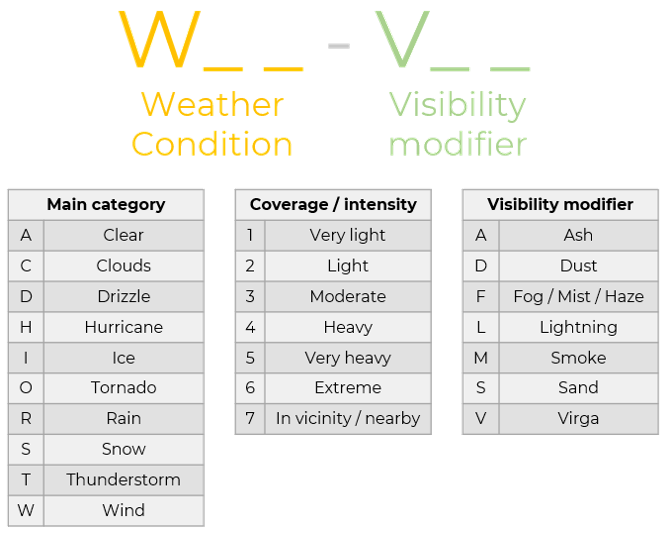

# Weather Codes
RAVEN simplifies weather codes by using a two-part alphanumeric combination comprising
two flags. The first flag, "W", indicates the weather portion of the combination, 
while the latter portion begins with a "V" flag, indicating Visibility factors.
Under this schema, confusing weather codes are eliminated, and only necessary weather
conditions are shown.

The "W" flag is followed by two entries. The first entry indicates the weather element
(clouds, rain, snow, etc.), while the second entry is a numeric value indicating the
intensity of the weather element. For instance, A "WA" flag indicates the weather 
condition of no clouds (clear skies), while a "WC1" flag indicates the presence of 
clouds with a light intensity. The schema further enables multiple weather conditions
to be combined, such as "WC1R1" to indicate light cloud cover and light rain.

Similarly, the "V" flag is followed by two entries. The first entry indicates the visibility
factor (fog, haze, etc.), while the second entry is a numeric value indicating the current
visibility factor. In the case where no visibility factors are present, the "V" flag is unused.
Alternatively, a flag of "VS4" indicates the presence of heavy smoke. A weather condition
causing a visibility condition (ex. heavy winds kicking dust into the air) would be easily
represented as WW5-VD4.

